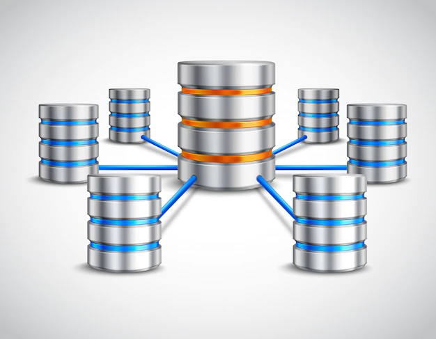
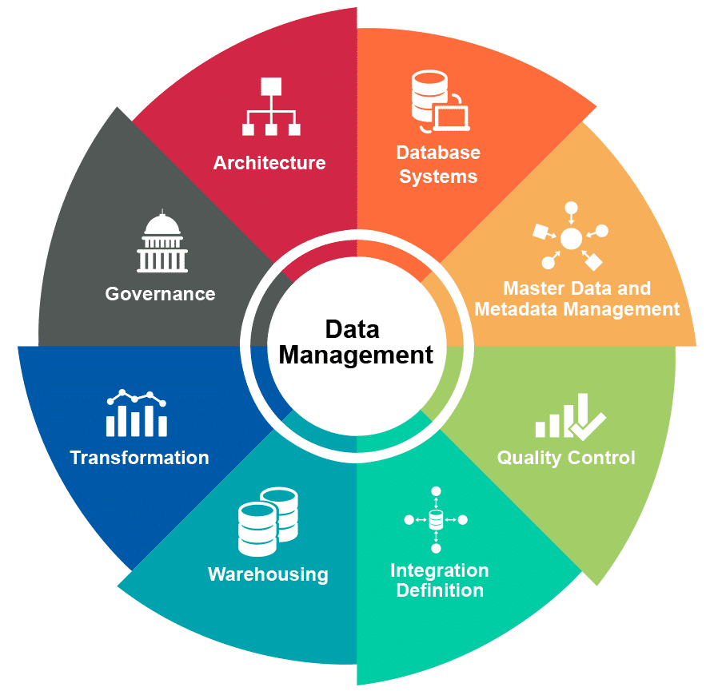
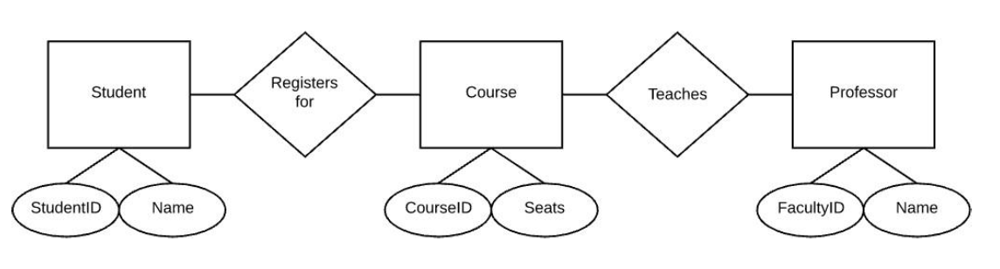
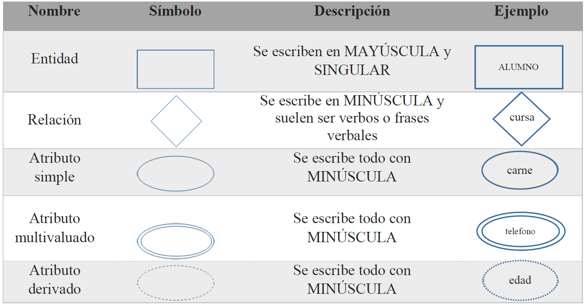

author: Brian Carranza, Alexei Quintana
summary: Laboratorio sobre el modelo entidad relación
id: laboratorio-01
tags: guide, relationship, entity
categories: Modelo, Diseño
environments: Web
status: Published
feedback link: https://github.com/01-2022-Bases-de-datos-UCA/Codelabs/issues

# Modelo Entidad - Relación

## Bases de datos
Duration: 0:03:00

Es una colección de datos relacionados. Estos se almacenan con el objetivo que diferentes programas y/o usuarios puedan acceder a ellos posteriormente.

Una base de datos tiene las siguientes propiedades implícitas:

* Representa algún aspecto del mundo real, en ocasiones llamada minimundo o universo de discurso (UoD). Las modificaciones del *minimundo* se reflejan en la base de datos.
* Es un conjunto de datos lógicamente coherente, con cierto significado. Una colección aleatoria de datos no puede considerarse propiamente como una base de datos.
* Se diseña, construye y alimenta con datos para un propósito específico. Está dirigida a un grupo de usuarios y tienen ciertas aplicaciones que interesan a los usuarios.

Suelen representarse como contenedores cilíndricos.

Ejemplo: Base de datos de expedientes de alumnos de la UCA **¿Puede ocuparse un archivo de texto como base de datos?**

## DBMS
Duration: 0:01:00

DBMS significa Database Management System, o Sistema de Gestión de Bases de Datos (SGBD) en español, y es un software que facilita el proceso de *definición, construcción, manipulación* y *el compartir* bases de datos entre varios usuarios y/o aplicaciones.

* **Definir** una base de datos implica especificar los tipos de datos, estructuras y restricciones de los datos a almacenar.
* **Construir** es el proceso que consiste en la carga de los datos en algún medio de almacenamiento que es controlado por el DBMS.
* **Manipulación** de la base de datos incluye funciones como recuperar datos específicos a través de consultas, actualizar el valor de la información y generar reportes de los datos.
* **Compartir** la base de datos permite múltiples usuarios y programas acceder a ella de manera simultánea.

Otras funciones importantes de un DBMS *son la protección y el mantenimiento* de la base. **Protegerla** contra un mal funcionamiento de hardware o software, y contra acceso malicioso o no autorizado. En cuanto al **mantenimiento**, es una característica que le permite al sistema evolucionar a medida cambian los requerimientos.

Algunos de los DBMS más populares en la industria son: 
Oracle RDBMS, Microsoft SQL Server,PostgreSQL, MySQL, MongoDB, etc.

Ahora la pregunta es *¿Cómo diseño mi base de datos?*

## Modelo Entidad-Relación
Duration: 0:02:00

El modelado conceptual es una fase muy importante en el diseño de una base de datos exitosa.Esto se hace por medio del modelo Entidad-Relación, el cuál describe los datos como entidades, relaciones y atributos. El principal objetivo es ilustrar como las entidades se relacionan entre sí en un sistema.

### Elementos del Modelo Entidad-Relación

**Entidad:** representa una *cosa u objeto* del mundo real con existencia independiente. Una entidad puede ser un objeto con existencia física, conocida como **entidad concreta** (por ejemplo: una persona, un carro, una casa, etc.) o un objeto con existencia conceptual, conocida como **entidad abstracta** (por ejemplo: un puesto de trabajo, una asignatura, un préstamo, etc.).

**Atributos:** son las características que definen o identifican a una entidad. Estas pueden ser muchas pero el diseñador solo utiliza o implementa las que considere **más relevantes.** Los tipos de atributos son: simples, compuestos, monovaluados, multivaluados, derivados y nulos.

**Relación:** describe cierta dependencia entre entidades o permite la asociación de las mismas. Esta también puede tener atributos cuando la cardinalidad es M:N (esto se explicará a detalle en otra sesión).

### Simbología de elementos.

### El concepto de minimundo
Al diseñar una base de datos para un escenario del mundo real, puede ser complicado identificar como *se relacionan las entidades*, es por eso que como diseñadores de BBDD, se debe definir ciertas **reglas** y **restricciones**, y eso sería definir el minimundo. Por ejemplo, para el escenario de “préstamo y devolución de libros de una biblioteca”, se pueden restringir o permitir algunas cosas como: “Un usuario solo puede prestar máximo 5 libros”, “Todo libro tiene que estar en un estante, pero puede haber estantes vacíos”, “Puede haber usuarios registrados que nunca hayan prestado un libro”, etc.

## Diagramas ER
Duration: 0:01:00

Se utilizará una herramienta llamada Draw.io, el cual es un sitio web que cuenta con los elementos necesarios para facilitar la realización de diversos tipos de diagrama, incluyendo el Entidad-Relación, y además es gratuito.
<https://app.diagrams.net/>

<aside class="positive">
    El modelo ER es la base para el diseño exitoso de la base de datos, pero más adelante se mostrará otro modelo y técnicas para mejorar el diseño de la base de datos.
</aside>

### Ejemplo práctico – Inscripción de materias

Para la inscripción de materias la Universidad (UCA) necesita llevar un registro de la información de cada estudiante, como nombre, fecha de nacimiento, id estudiantil, dirección y teléfonos.

Se llevará el registro del docente que impartirá cada materia, y se necesitan tomar los siguientes datos: nombre, fecha de nacimiento, dirección, teléfono y carne de identidad única. Para cada materia se llevarán registros del nombre y el código.

Es indispensable llevar un registro del año y el ciclo en que se impartirá dicha materia.

<aside class="positive">
<b>TIPS:</b>
<ol>
<li>Cada entidad debe poseer un <b>atributo clave</b> que la diferencie del resto de entidades del mismo tipo.</li>
<li>Debemos incluir tantos atributos como sea necesario para cumplir los <b>requerimientos del sistema</b>, siempre y cuando aporten un valor a la base de datos.</li>
<li>Todos los elementos de un diagrama ER se unen con otros por medio de <b>líneas rectas</b>. Ya sean atributos a entidades, atributos compuestos a sus componentes o entidades a relaciones.</li>
</aside>